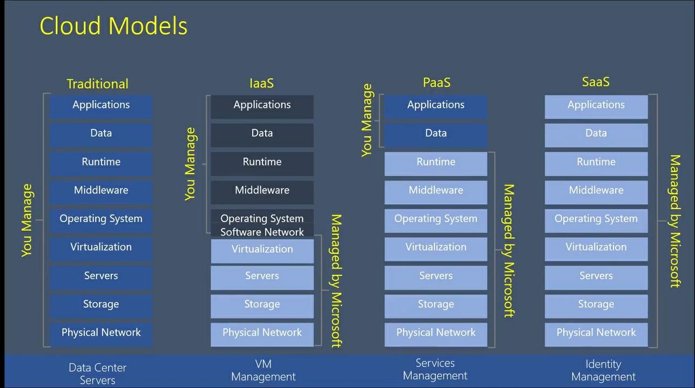
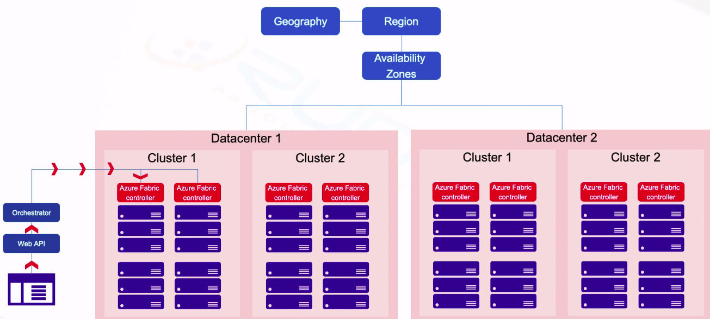
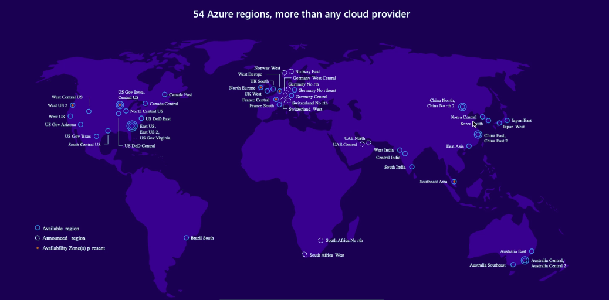
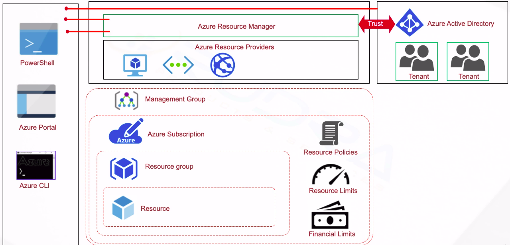

# Introduction to cloud computing

Rent the infrastructures, resources and services, pay by time and usage

### Benefits of cloud computing
- Cost
- Speed
- Scalability
- Productivity
- Reliablity
- Security
- To build a datacenter it takes time in months but cloud in hours

### Types of cloud
Public cloud - services over internet. owned by third party
Private cloud - on premisis in a company. owned by company
Hybrid cloud - share between hybrid and private cloud

### Types of cloud services
- Infrastructure as a service(IaaS): AWS, Azure, Digital Ocean, GCP
- Platform as a service(PaaS): 
- Software as a Service(SaaS): Gmail, Drive, Office365

## About Azure

- Over 100 end to end servers
- [Azure portel](http://portel.azure.com)

### undurestanding Azure
- Using concept of virtualization
- Contains Racks > software (Azure Fabric controller) to debug the racks and heals > software (Orchestrator: To manage resources, basic checks) > Web API > user
- Several Racks becomes cluster > several clusters becomes datacenter > several datacenters becomes availability zones > multiple availablity zones becomes region > multiple regions in a Geography

- Understand Regions

### Azure resources structure
- Resource: Entity managed by azure(VM, network etc.,)
- Resource Group: Logical group of Resources.
- Azure Subscription: Billing entity, almost like resource group, controles(Resource plolcies, Limits, financial policy)
- Management Group: Enterprise level governence rules.
- Azure Resource Manager(An Orchestrator): API to accept requests from Azure Portal and CLI. Also have Azure active directory(To authinticate and authorize users)
- Azure Resource Provider: Manage the transactions

